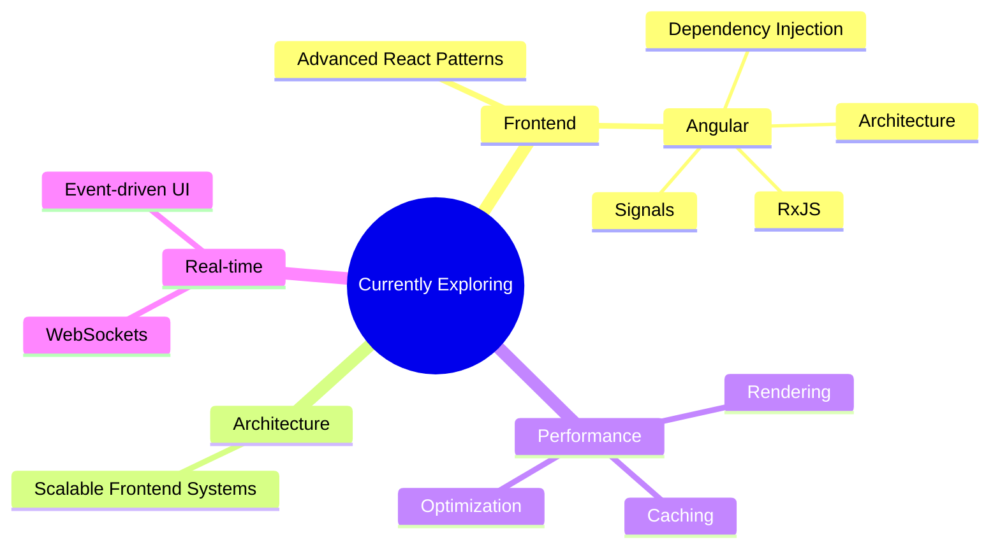

### Frontend Engineer • React • TypeScript • Next.js

Building scalable web applications, thoughtful interfaces, and maintainable frontend architectures.

  
  &nbsp;&nbsp;
  
  &nbsp;&nbsp;
  

---

## 👨‍💻 About Me

I'm a Frontend Engineer focused on building **scalable, maintainable, and high-quality web applications**.

I enjoy turning complex requirements into simple interfaces, designing reusable systems, and continuously improving the architecture behind the UI.

- ⚛️ React & TypeScript enthusiast
- 🏗️ Interested in scalable frontend architecture
- 🎨 Love building clean and consistent UI systems
- ⚡ Focused on performance and developer experience
- 🧩 Enjoy solving complex frontend problems
- 🧠 Always learning something new

---

## ✨ What I Enjoy Building

| 🧩 Area                   | 💡 What I Enjoy                                                                    |
| ------------------------- | ---------------------------------------------------------------------------------- |
| **Component Systems**     | Building reusable, flexible, and consistent UI components                          |
| **Frontend Architecture** | Designing scalable architectures that stay maintainable as applications grow       |
| **Complex Interfaces**    | Building dashboards, admin panels, data-heavy apps, forms, and workflows           |
| **Performance**           | Optimizing rendering, caching, data fetching, bundle size, and overall UX          |
| **State Management**      | Designing predictable and scalable client & server state architectures             |
| **Responsive UI**         | Creating polished experiences that work beautifully across all screen sizes        |
| **Design Systems**        | Turning design patterns into consistent, reusable, and accessible UI systems       |
| **Developer Experience**  | Creating abstractions and patterns that make frontend development faster and safer |

---

## 🛠 Tech Stack

### Languages

  

### Frontend

  

### Backend & Infrastructure

  

  

### Tooling & Workflow

  

    

---

## 🧠 Currently Exploring

<table>
<tr>
<td width="50%" valign="top">

### 📚 Learning

| Area                | Exploring                          |
| ------------------- | ---------------------------------- |
| ⚡ **Frontend**     | Advanced React Patterns            |
| 🅰️ **Angular**      | Signals · RxJS · DI · Architecture |
| 🏗️ **Architecture** | Scalable Frontend Systems          |
| 🚀 **Performance**  | Rendering · Caching · Optimization |
| 🔄 **Real-time**    | WebSockets · Event-driven UI       |

</td>

<td width="50%" valign="top">

</td>
</tr>
</table>

---

## 📊 GitHub Activity

<picture>
  <source media="(prefers-color-scheme: dark)" srcset="https://raw.githubusercontent.com/Ali-Asad1/Ali-Asad1/output/github-contribution-grid-snake-dark.svg">
  <source media="(prefers-color-scheme: light)" srcset="https://raw.githubusercontent.com/Ali-Asad1/Ali-Asad1/output/github-contribution-grid-snake.svg">
  
</picture>
